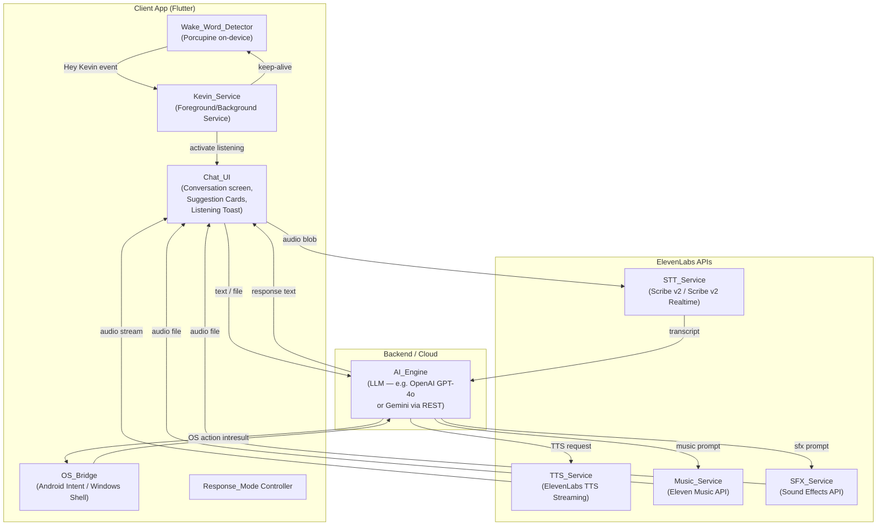
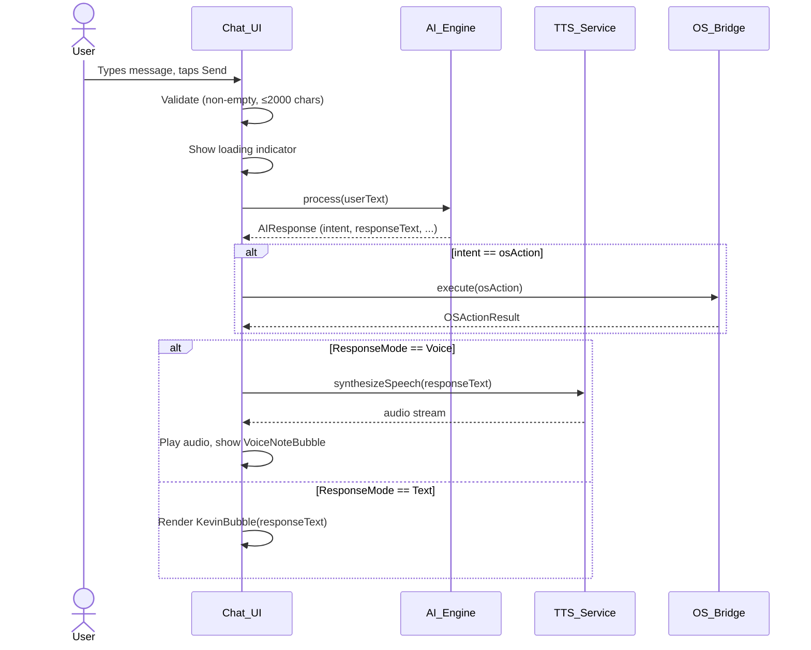
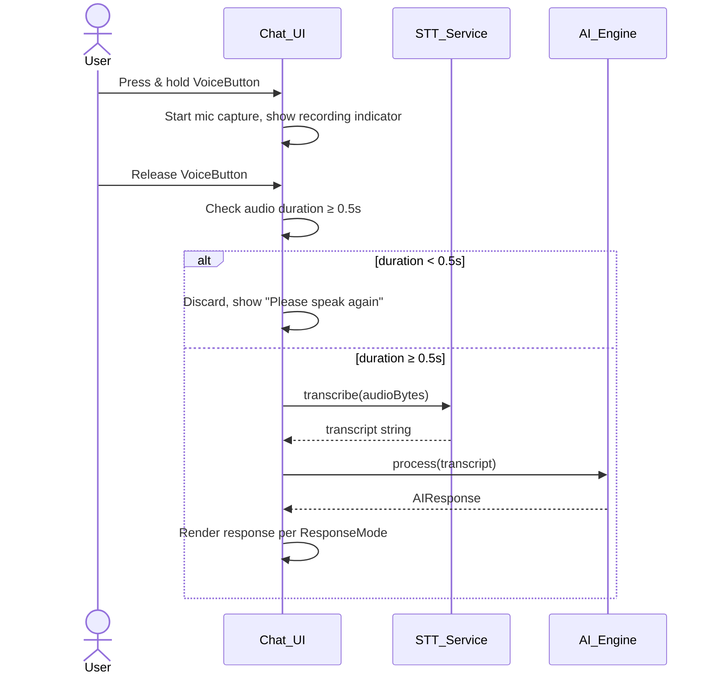
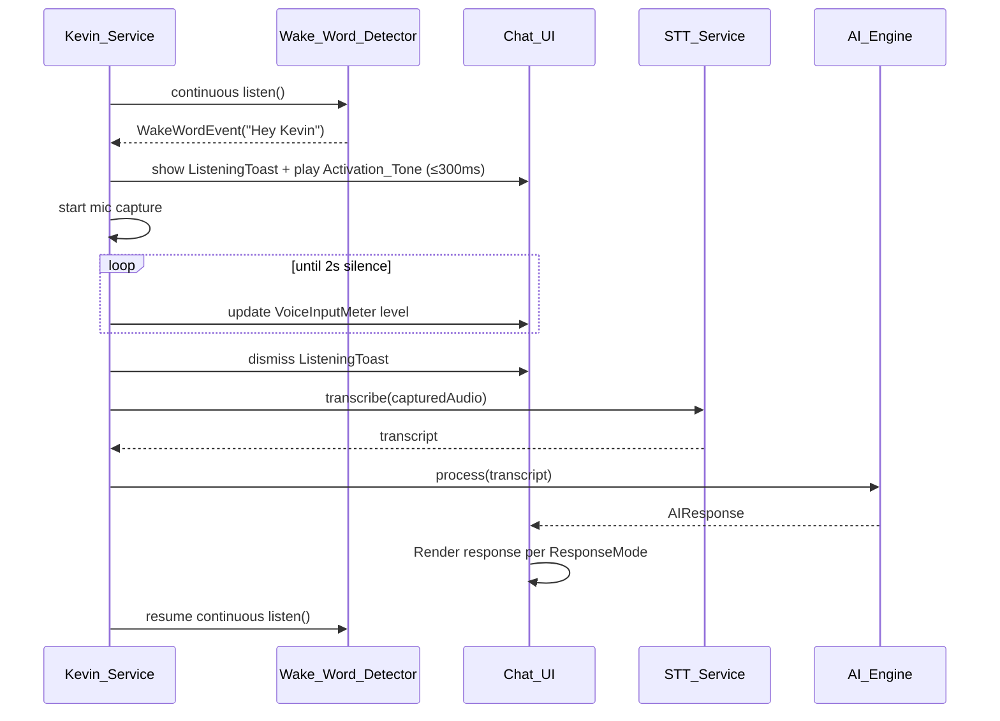
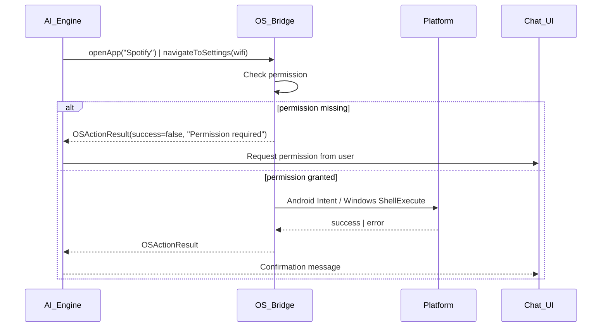
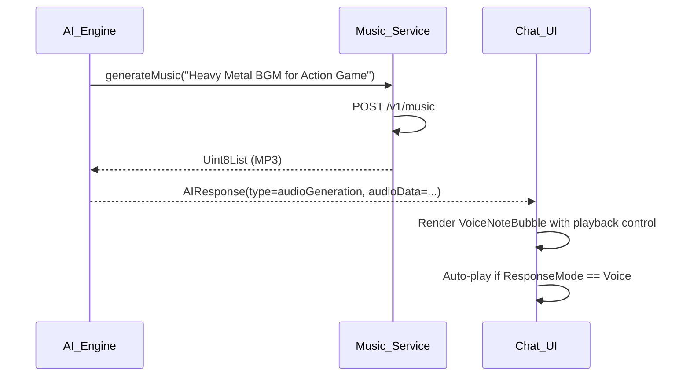

# Design Document — Project Kevin

## Overview

Project Kevin is a cross-platform AI assistant for Android and Windows. Users interact via text or voice; Kevin interprets intent, executes OS-level actions, answers general queries, and generates audio content (TTS, music, sound effects) through the ElevenLabs API suite. A persistent background service keeps the wake word detector active so users can invoke Kevin hands-free at any time.

### Key Design Goals

- Single shared codebase (Flutter/Dart) targeting Android and Windows
- All audio I/O routed through ElevenLabs APIs (STT, TTS, Music, SFX)
- On-device wake word detection via Picovoice Porcupine — no cloud round-trip for activation
- Strict SciFi_Theme applied uniformly across all surfaces
- Graceful degradation when offline or when ElevenLabs is unreachable

---

## Architecture

### High-Level Component Diagram



### Component Responsibilities

| Component | Responsibility |
|---|---|
| **Chat_UI** | Renders conversation, input bar, suggestion cards, listening toast, response mode toggle, quit button |
| **AI_Engine** | Classifies intent (OS action vs. general query vs. ElevenLabs generation), generates response text |
| **OS_Bridge** | Translates AI_Engine intents into platform-specific calls (Android Intents, Windows Shell/COM) |
| **STT_Service** | Sends audio blobs to ElevenLabs Scribe v2; returns transcript strings |
| **TTS_Service** | Sends response text to ElevenLabs TTS streaming endpoint; returns audio stream |
| **Music_Service** | Sends natural-language music prompts to ElevenLabs Music API (`POST /v1/music`) |
| **SFX_Service** | Sends natural-language SFX prompts to ElevenLabs Sound Effects API (`POST /v1/sound-generation`) |
| **Wake_Word_Detector** | Runs Porcupine on-device; fires event on "Hey Kevin" detection |
| **Kevin_Service** | Android foreground service / Windows background process; owns Wake_Word_Detector lifecycle |

---

## Technology Stack

### Cross-Platform UI — Flutter (Dart)

Flutter is chosen because it compiles to native ARM/x64 code on both Android and Windows from a single Dart codebase, supports custom rendering (critical for the SciFi_Theme), and has mature plugin ecosystems for audio, permissions, and platform channels.

- **Flutter 3.x** — stable channel, Windows desktop support GA
- **Dart 3.x** — null-safe, async/await, isolates for background work
- **flutter_foreground_task** — Android foreground service management
- **permission_handler** — unified microphone/storage permission requests
- **just_audio** — cross-platform audio playback for TTS/SFX/Music output
- **record** — cross-platform microphone capture
- **google_fonts** — Orbitron / Exo 2 font loading

### Wake Word Detection — Picovoice Porcupine

Porcupine runs entirely on-device (no network required), supports Android and Windows, and provides a custom wake word model trained for "Hey Kevin". The Flutter plugin `porcupine_flutter` wraps the native SDK.

- Custom wake word model file: `hey-kevin.ppn` (trained via Picovoice Console)
- Sensitivity: configurable 0.0–1.0 (default 0.5)
- CPU overhead: < 2% on modern devices

### AI Backend

The AI_Engine is a thin REST client. The recommended model is **OpenAI GPT-4o** (or **Google Gemini 1.5 Flash** as a cost-effective alternative). The client sends a system prompt that instructs the model to classify intent and return structured JSON:

```json
{
  "intent": "os_action | general_query | elevenlabs_tts | elevenlabs_music | elevenlabs_sfx",
  "response_text": "...",
  "os_action": { "type": "open_app | navigate_settings", "target": "..." }
}
```

### ElevenLabs SDK

The official **ElevenLabs TypeScript/JavaScript SDK** (`elevenlabs` npm package) is not directly usable in Flutter. Instead, Kevin uses direct REST calls via Dart's `http` / `dio` packages against the ElevenLabs REST API:

| Capability | Endpoint | Notes |
|---|---|---|
| STT (batch) | `POST /v1/speech-to-text` | Scribe v2 model, audio file upload |
| STT (realtime) | WSS `/v1/speech-to-text/stream` | Scribe v2 Realtime, 150ms latency |
| TTS (streaming) | `POST /v1/text-to-speech/{voice_id}/stream` | Returns MP3 audio stream |
| Music | `POST /v1/music` | Returns MP3; async polling for long generations |
| Sound Effects | `POST /v1/sound-generation` | Returns MP3 |

Authentication: `xi-api-key` header on all requests.

---

## Components and Interfaces

### Chat_UI

```
ConversationScreen
├── AppBar (SciFi styled, Quit button top-right)
├── ResponseModeToggle (Voice / Text switch)
├── ConversationView (scrollable ListView)
│   ├── [Empty state] SuggestionCardGrid (6+ cards)
│   └── [Active] MessageBubble list
│       ├── UserBubble (right-aligned, red border)
│       ├── KevinBubble (left-aligned, dark bg, red accent)
│       └── VoiceNoteBubble (waveform + play button)
├── ListeningToast (overlay, shown during wake-word capture)
│   ├── Label "Kevin is listening..."
│   └── VoiceInputMeter (circular animated ring)
└── InputBar
    ├── AttachButton (left)
    ├── TextField (center, 2000 char limit)
    ├── VoiceButton (right of field)
    └── SendButton (rightmost, disabled when empty)
```

### Kevin_Service Interface

```dart
abstract class IKevinService {
  Future<void> start();
  Future<void> stop();          // called by Quit_Action
  Stream<WakeWordEvent> get wakeWordEvents;
  bool get isRunning;
}
```

### OS_Bridge Interface

```dart
abstract class IOSBridge {
  Future<OSActionResult> openApp(String appName);
  Future<OSActionResult> navigateToSettings(SettingsTarget target);
}

enum SettingsTarget { wifi, bluetooth, display, sound, battery, storage }

class OSActionResult {
  final bool success;
  final String? errorMessage;
}
```

### ElevenLabs Client Interface

```dart
abstract class IElevenLabsClient {
  Future<String> transcribe(Uint8List audioBytes);
  Stream<Uint8List> synthesizeSpeech(String text, String voiceId);
  Future<Uint8List> generateMusic(String prompt);
  Future<Uint8List> generateSoundEffect(String prompt);
}
```

### AI Engine Interface

```dart
abstract class IAIEngine {
  Future<AIResponse> process(String userText, {Uint8List? attachment});
}

class AIResponse {
  final String responseText;
  final AIIntent intent;
  final OSActionSpec? osAction;
  final ElevenLabsGenerationSpec? generationSpec;
}

enum AIIntent { generalQuery, osAction, elevenLabsTTS, elevenLabsMusic, elevenLabsSFX }
```

---

## Data Models

### Message

```dart
class Message {
  final String id;           // UUID
  final MessageRole role;    // user | kevin
  final MessageType type;    // text | voiceNote | audioGeneration | error
  final String? text;
  final Uint8List? audioData;
  final String? audioMimeType;
  final DateTime timestamp;
  final MessageStatus status; // sending | delivered | error
}

enum MessageRole { user, kevin }
enum MessageType { text, voiceNote, audioGeneration, error }
enum MessageStatus { sending, delivered, error }
```

### AppSettings

```dart
class AppSettings {
  final ResponseMode responseMode;  // voice | text
  final bool wakeWordEnabled;
  final double wakeWordSensitivity; // 0.0 – 1.0
  final String elevenLabsApiKey;
  final String aiApiKey;
  final String ttsVoiceId;
}

enum ResponseMode { voice, text }
```

### SuggestionCard

```dart
class SuggestionCard {
  final String id;
  final String label;
  final String promptText;
  final SuggestionCategory category;
}

enum SuggestionCategory { elevenLabs, osAction, generalQuery }
```

### Default Suggestion Cards

| # | Label | Prompt | Category |
|---|---|---|---|
| 1 | Generate Heavy Metal BGM | "Generate a Heavy Metal BGM for an Action Game" | elevenLabs |
| 2 | Thunderstorm SFX | "Create a sound effect of a thunderstorm" | elevenLabs |
| 3 | Dramatic voice read | "Read this text in a dramatic voice: [text]" | elevenLabs |
| 4 | Open Spotify | "Open Spotify" | osAction |
| 5 | Wi-Fi Settings | "Open Wi-Fi settings" | osAction |
| 6 | What time is it? | "What time is it?" | generalQuery |
| 7 | Sci-fi ambience | "Generate a sci-fi spaceship ambient sound" | elevenLabs |
| 8 | Capital of France | "What is the capital of France?" | generalQuery |

### WakeWordEvent

```dart
class WakeWordEvent {
  final DateTime detectedAt;
  final double confidence;
}
```

---

## Data Flow

### 1. Text Input Flow



### 2. Voice Input Flow (Button Press)



### 3. Wake Word Activation Flow



### 4. OS Action Flow



### 5. ElevenLabs Music / SFX Generation Flow



---

## OS Bridge Design

### Android Implementation

```dart
class AndroidOSBridge implements IOSBridge {
  @override
  Future<OSActionResult> openApp(String appName) async {
    // 1. Query PackageManager for installed packages matching appName
    // 2. Resolve package name via fuzzy match
    // 3. Launch via Intent(Intent.ACTION_MAIN) with CATEGORY_LAUNCHER
    // 4. Return success/failure
  }

  @override
  Future<OSActionResult> navigateToSettings(SettingsTarget target) async {
    // Map SettingsTarget → android.settings.* action string
    // e.g. SettingsTarget.wifi → Settings.ACTION_WIFI_SETTINGS
    // Launch via startActivity(Intent(action))
  }
}
```

**Android Intent Mapping:**

| SettingsTarget | Android Intent Action |
|---|---|
| wifi | `android.settings.WIFI_SETTINGS` |
| bluetooth | `android.settings.BLUETOOTH_SETTINGS` |
| display | `android.settings.DISPLAY_SETTINGS` |
| sound | `android.settings.SOUND_SETTINGS` |
| battery | `android.settings.BATTERY_SAVER_SETTINGS` |
| storage | `android.settings.INTERNAL_STORAGE_SETTINGS` |

### Windows Implementation

```dart
class WindowsOSBridge implements IOSBridge {
  @override
  Future<OSActionResult> openApp(String appName) async {
    // 1. Search Start Menu / registry for installed apps matching appName
    // 2. Execute via Process.run(executablePath)
    // 3. Fallback: ShellExecute with appName as verb
  }

  @override
  Future<OSActionResult> navigateToSettings(SettingsTarget target) async {
    // Map SettingsTarget → ms-settings: URI scheme
    // Launch via Process.run('start', ['ms-settings:wifi'])
  }
}
```

**Windows ms-settings URI Mapping:**

| SettingsTarget | ms-settings URI |
|---|---|
| wifi | `ms-settings:network-wifi` |
| bluetooth | `ms-settings:bluetooth` |
| display | `ms-settings:display` |
| sound | `ms-settings:sound` |
| battery | `ms-settings:batterysaver` |
| storage | `ms-settings:storagesense` |

---

## Wake Word Detection Design

### Porcupine Integration

Porcupine runs as a native library loaded via Flutter's FFI/platform channel. The custom "Hey Kevin" wake word model (`.ppn` file) is bundled as an app asset.

```dart
class PorcupineWakeWordDetector {
  late PorcupineManager _manager;

  Future<void> start() async {
    _manager = await PorcupineManager.fromKeywordPaths(
      accessKey: Env.picovoiceAccessKey,
      keywordPaths: ['assets/hey-kevin.ppn'],
      wakeWordCallback: _onWakeWord,
      sensitivity: 0.5,
    );
    await _manager.start();
  }

  void _onWakeWord(int keywordIndex) {
    _eventController.add(WakeWordEvent(
      detectedAt: DateTime.now(),
      confidence: 0.5,
    ));
  }

  Future<void> stop() => _manager.stop();
  Future<void> delete() => _manager.delete();
}
```

### Kevin_Service Lifecycle

**Android (Foreground Service):**

1. `Kevin_Service` extends `FlutterForegroundTask` (via `flutter_foreground_task` plugin)
2. Displays persistent notification with "Open Kevin" and "Quit" action buttons
3. Notification channel: `kevin_service_channel`, importance HIGH
4. `START_STICKY` — OS restarts service within 5 seconds if killed
5. Porcupine detector runs in the foreground service isolate

**Windows (Background Process):**

1. Kevin registers as a Windows startup entry (optional, user-controlled)
2. System tray icon with context menu: "Open Kevin", "Quit"
3. Porcupine runs in a Dart isolate spawned at app start
4. No equivalent of Android foreground service; process stays alive as long as the window or tray icon exists

---

## UI/UX Design

### SciFi_Theme Specification

| Token | Value |
|---|---|
| `colorBackground` | `#000000` |
| `colorSurface` | `#0D0D0D` |
| `colorAccent` | `#CC0000` (red) |
| `colorAccentDim` | `#660000` |
| `colorTextPrimary` | `#FFFFFF` |
| `colorTextSecondary` | `#888888` |
| `colorBorderUser` | `#CC0000` |
| `colorBorderKevin` | `#333333` |
| `fontFamily` | Orbitron (headings), Exo 2 (body) |
| `borderRadius` | 8dp |
| `bubblePadding` | 12dp horizontal, 8dp vertical |

### Main Conversation Screen Layout

```
┌─────────────────────────────────────────┐
│  [KEVIN]              [Voice|Text] [✕]  │  ← AppBar (Orbitron, red accent)
├─────────────────────────────────────────┤
│                                         │
│  ┌─────────────────────────────────┐    │
│  │ Kevin bubble (left-aligned)     │    │  ← dark bg, red-left-border
│  └─────────────────────────────────┘    │
│                                         │
│         ┌───────────────────────────┐   │
│         │ User bubble (right-align) │   │  ← red border
│         └───────────────────────────┘   │
│                                         │
│  [Empty state: Suggestion Cards grid]   │
│                                         │
├─────────────────────────────────────────┤
│ [📎]  [Type a message...      ] [🎤][➤] │  ← InputBar
└─────────────────────────────────────────┘
```

### Listening Toast Overlay

```
┌─────────────────────────────────────────┐
│                                         │
│         ╔═══════════════════╗           │
│         ║  ◉ (animated ring)║           │  ← VoiceInputMeter: circular
│         ║  Kevin is         ║           │    red ring, pulses with mic level
│         ║  listening...     ║           │
│         ╚═══════════════════╝           │
│                                         │
└─────────────────────────────────────────┘
```

The `VoiceInputMeter` is a `CustomPainter` that draws a circular arc whose sweep angle maps linearly to the current RMS audio level (0.0–1.0). It animates at 60fps using a `Ticker`.

### Suggestion Cards (Empty State)

Cards are displayed in a 2-column `Wrap` widget. Each card:
- Black background, red border (1dp), 8dp corner radius
- Orbitron label (12sp), Exo 2 sub-label (10sp, grey)
- Tap → populate InputBar text field

### Android Status Bar Notification

```
┌──────────────────────────────────────────────────────┐
│ [Kevin icon]  Kevin is active                        │
│               Wake word detection running            │
│ [Open Kevin]                              [Quit]     │
└──────────────────────────────────────────────────────┘
```

- Channel: `kevin_service_channel`
- Priority: `PRIORITY_LOW` (non-intrusive)
- Ongoing: `true` (cannot be dismissed by swipe)
- Actions: `PendingIntent` for "Open Kevin" (bring to foreground), `PendingIntent` for "Quit" (broadcast → `Quit_Action`)

---

## ElevenLabs Integration

### STT — Scribe v2

For button-triggered voice input, Kevin uses the batch STT endpoint:

```
POST https://api.elevenlabs.io/v1/speech-to-text
Headers: xi-api-key: {key}
Body: multipart/form-data
  - audio: <audio file bytes>
  - model_id: scribe_v2
```

For wake-word-triggered voice input where low latency matters, Kevin uses the Scribe v2 Realtime WebSocket:

```
WSS wss://api.elevenlabs.io/v1/speech-to-text/stream
  → stream PCM audio chunks
  ← receive partial + final transcripts
```

### TTS — Streaming

```
POST https://api.elevenlabs.io/v1/text-to-speech/{voice_id}/stream
Headers: xi-api-key: {key}
Body: { "text": "...", "model_id": "eleven_multilingual_v2" }
Response: audio/mpeg stream
```

Kevin pipes the response stream directly into `just_audio`'s `StreamAudioSource` for low-latency playback.

### Music Generation — Eleven Music

```
POST https://api.elevenlabs.io/v1/music
Headers: xi-api-key: {key}
Body: { "prompt": "Heavy Metal BGM for an Action Game", "output_format": "mp3_44100_128" }
Response: { "audio_url": "...", "generation_id": "..." }
```

Music generation is asynchronous. Kevin polls the generation status endpoint until complete, then downloads and plays the MP3.

### Sound Effects Generation

```
POST https://api.elevenlabs.io/v1/sound-generation
Headers: xi-api-key: {key}
Body: { "text": "thunderstorm with heavy rain and lightning", "duration_seconds": 10 }
Response: audio/mpeg (direct binary)
```

Sound effects return synchronously as a binary audio response.

### Intent Classification for ElevenLabs

The AI_Engine system prompt instructs the LLM to detect ElevenLabs generation requests:

- "Generate [music/BGM/soundtrack/song]..." → `intent: elevenlabs_music`
- "Create a sound effect of..." → `intent: elevenlabs_sfx`
- "Read this in [voice style]..." → `intent: elevenlabs_tts` (with custom voice parameters)

---

## Error Handling

### Connectivity

```dart
class ConnectivityGuard {
  Future<T> withConnectivity<T>(Future<T> Function() request) async {
    if (!await _isConnected()) {
      throw OfflineException('No internet connection');
    }
    return request().timeout(
      const Duration(seconds: 10),
      onTimeout: () => throw TimeoutException('Request timed out'),
    );
  }
}
```

### Error → UI Mapping

| Error Type | UI Response |
|---|---|
| `OfflineException` | Red inline error bubble: "No internet connection. Please check your network." |
| `TimeoutException` | Error bubble with Retry button |
| `STTTranscriptionError` | "Could not understand audio. Please try again." |
| `TTSSynthesisError` | Fall back to text bubble + "Voice output temporarily unavailable" |
| `OSActionError` | Descriptive message: "Could not open [app]: [reason]" |
| `FileTooLargeError` | Inline error below attachment: "File exceeds 10 MB limit" |
| `UnsupportedFileTypeError` | Inline error: "Supported types: JPEG, PNG, PDF, TXT" |
| `CharacterLimitError` | Inline counter turns red at 2000 chars; send button disabled |
| `AudioTooShortError` | Toast: "Recording too short. Please speak again." |

### Kevin_Service Restart (Android)

If the OS kills `Kevin_Service`, the `START_STICKY` flag causes Android to restart it. The service re-initialises Porcupine and resumes listening. A `BroadcastReceiver` for `BOOT_COMPLETED` re-starts the service after device reboot if wake word was enabled.

### Offline Fallback

When offline, Kevin can still:
- Display conversation history (in-memory for the session)
- Execute OS actions (no network required)
- Answer time/date queries from device clock

Kevin cannot (and clearly communicates this):
- Process voice input (STT requires ElevenLabs)
- Generate voice output (TTS requires ElevenLabs)
- Answer general knowledge queries (AI_Engine requires network)

---

## Testing Strategy

### Unit Tests

- `AI_Engine` intent classification with mocked LLM responses
- `OS_Bridge` action mapping (SettingsTarget → Intent/URI string)
- `Message` model serialization/deserialization
- `AppSettings` persistence (SharedPreferences mock)
- Input validation: character limit, audio duration threshold, file size/type checks
- `ConnectivityGuard` timeout and offline behavior

### Integration Tests

- ElevenLabs STT: send a known audio clip, verify transcript matches expected text (1–2 examples)
- ElevenLabs TTS: send known text, verify audio bytes returned are non-empty and valid MP3
- ElevenLabs Music: send a prompt, verify audio response is returned within timeout
- ElevenLabs SFX: send a prompt, verify audio response is returned
- Android foreground service start/stop lifecycle
- Windows background process tray icon lifecycle

### Widget Tests

- `ConversationView` renders empty state with ≥6 suggestion cards
- `ConversationView` hides suggestion cards after first message
- `InputBar` send button disabled when text field is empty
- `ListeningToast` appears and dismisses correctly
- `ResponseModeToggle` persists selection across widget rebuilds
- SciFi_Theme colors and fonts applied to all key widgets

### Property-Based Tests

See Correctness Properties section below. Property tests use the **`fast_check`** Dart port or, if unavailable, **`dart_test`** with a custom generator harness. Each property test runs a minimum of 100 iterations.

Tag format: `// Feature: project-kevin, Property N: <property_text>`


---

## Correctness Properties

*A property is a characteristic or behavior that should hold true across all valid executions of a system — essentially, a formal statement about what the system should do. Properties serve as the bridge between human-readable specifications and machine-verifiable correctness guarantees.*

Project Kevin has significant pure-logic layers (input validation, intent routing, OS action mapping, state management, persistence) that are well-suited to property-based testing. The properties below are derived from the acceptance criteria and focus on universal behaviors that hold across all valid inputs.

**PBT Library:** [`propcheck`](https://pub.dev/packages/propcheck) (Dart) — runs each property a minimum of 100 iterations with shrinking support.

---

### Property 1: Message Bubble Alignment Matches Role

*For any* message with role `user`, the rendered bubble SHALL be right-aligned; *for any* message with role `kevin`, the rendered bubble SHALL be left-aligned. The alignment is determined solely by the message role, regardless of message content, length, or type.

**Validates: Requirements 2.2, 2.3**

---

### Property 2: Response Delivery Mode Matches Active ResponseMode

*For any* AI response generated while `ResponseMode == Voice`, the system SHALL invoke the TTS pipeline and produce audio output. *For any* AI response generated while `ResponseMode == Text`, the system SHALL render a text bubble and SHALL NOT invoke the TTS pipeline. The delivery mode is determined solely by the active `ResponseMode` setting at the time the response is generated.

**Validates: Requirements 5.2, 5.3**

---

### Property 3: ResponseMode Persists Across Restarts

*For any* `ResponseMode` value (`voice` or `text`) written to persistent storage, reading it back after a simulated app restart SHALL return the same value. This is a round-trip persistence property.

**Validates: Requirements 5.4**

---

### Property 4: OS Action Target Maps to Correct Platform Command

*For any* `SettingsTarget` enum value on Android, `OS_Bridge.navigateToSettings` SHALL produce the corresponding `android.settings.*` intent action string. *For any* `SettingsTarget` enum value on Windows, it SHALL produce the corresponding `ms-settings:` URI. The mapping is a pure function with no side effects.

**Validates: Requirements 6.2, 6.3**

---

### Property 5: OS Action Result Always Produces User Feedback

*For any* `OSActionResult` — whether `success == true` or `success == false` — the system SHALL deliver a non-empty feedback message to the user via the active `ResponseMode`. A successful result produces a confirmation; a failed result produces a descriptive error message. No OS action result is silently swallowed.

**Validates: Requirements 6.4, 6.5**

---

### Property 6: Short Audio Clips Are Discarded Without STT Submission

*For any* audio recording with a duration strictly less than 0.5 seconds — whether triggered by button press or wake word activation — the system SHALL discard the recording and SHALL NOT submit it to the ElevenLabs STT API. The STT client's `transcribe` method must not be called.

**Validates: Requirements 4.6, 11.8**

---

### Property 7: Character Limit Enforced on Text Input

*For any* string with `length > 2000` characters entered into the text input field, the system SHALL disable the send button and SHALL display an inline character-limit error indicator. *For any* string with `length ≤ 2000` characters, the send button SHALL remain enabled (assuming the field is non-empty).

**Validates: Requirements 3.3**

---

### Property 8: File Attachment Constraints Enforced

*For any* file with `size > 10 MB`, the system SHALL reject the attachment and display an error message. *For any* file whose MIME type is not in `{image/jpeg, image/png, application/pdf, text/plain}`, the system SHALL reject the attachment and display an error listing the supported types. Valid files (size ≤ 10 MB and supported type) SHALL be accepted.

**Validates: Requirements 8.4, 8.5**

---

### Property 9: Wake Word Event Triggers ListeningToast and Mic Capture

*For any* `WakeWordEvent` emitted by the `Wake_Word_Detector` while `Kevin_Service` is running, the system SHALL (a) make the `ListeningToast` visible in the UI and (b) begin capturing audio from the microphone. Both effects must occur for every wake word detection event.

**Validates: Requirements 11.3, 11.5**

---

### Property 10: STT Submission Dismisses ListeningToast

*For any* audio submission event sent to the STT service (whether triggered by silence timeout or button release), the `ListeningToast` SHALL be dismissed from the UI before or at the moment of submission. The toast must not remain visible after the audio has been handed off to STT.

**Validates: Requirements 11.7**

---

### Property 11: Silence Timeout Triggers STT Submission

*For any* active audio capture session initiated by wake word detection, if the measured audio level remains below the silence threshold for a continuous period of 2 seconds, the system SHALL stop capturing and submit the accumulated audio to the STT service. This property holds regardless of the content of the audio captured before the silence period.

**Validates: Requirements 11.6**

---

### Property 12: Kevin_Service Running Implies Wake_Word_Detector Active

*For any* state in which `Kevin_Service.isRunning == true` — regardless of whether the Kevin app UI is in the foreground or background — `Wake_Word_Detector.isActive` SHALL also be `true`. The detector must never be inactive while the service is running.

**Validates: Requirements 12.3**

---

### Property 13: Quit_Action Terminates All Kevin Components

*For any* invocation of `Quit_Action` (from the in-app button or the notification action), the system SHALL ensure that after the action completes: `Kevin_Service.isRunning == false`, `Wake_Word_Detector.isActive == false`, and the persistent status bar notification is dismissed. All three conditions must hold simultaneously; partial termination is not acceptable.

**Validates: Requirements 13.3, 13.4**

---

### Property 14: Suggestion Card Tap Populates Input Field

*For any* `SuggestionCard` in the suggestion card grid, tapping it SHALL result in the `InputBar` text field containing exactly the card's `promptText` — no more, no less. The population is a pure mapping from card to text field content.

**Validates: Requirements 15.3**

---

### Property 15: Messages Present Implies No Suggestion Cards

*For any* `ConversationView` state in which the message list contains one or more messages, the view SHALL display zero `SuggestionCard` widgets. Conversely, *for any* `ConversationView` state in which the message list is empty, the view SHALL display at least six `SuggestionCard` widgets. These two conditions are mutually exclusive and exhaustive.

**Validates: Requirements 15.1, 15.5, 15.6**
